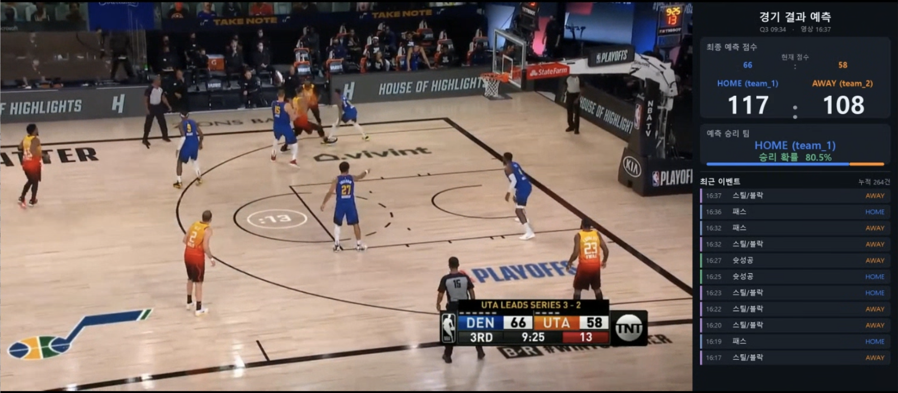
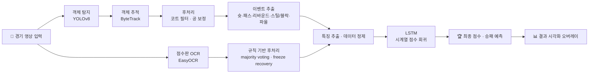
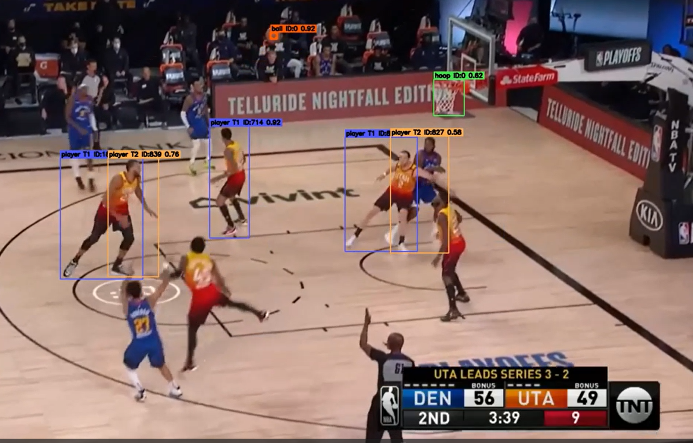
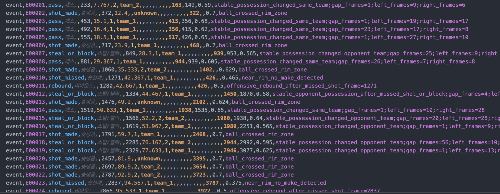
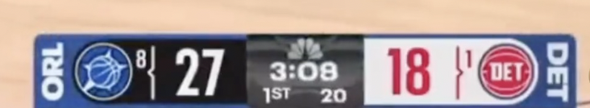
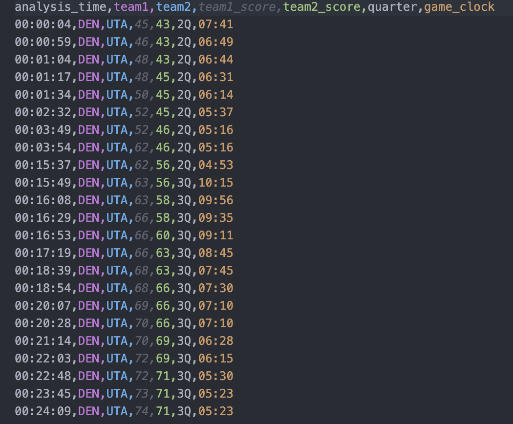
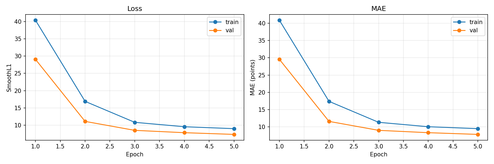
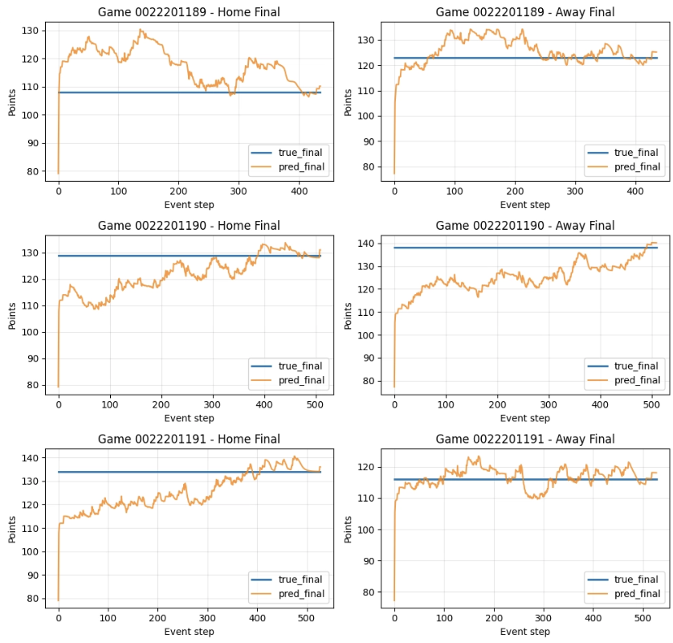
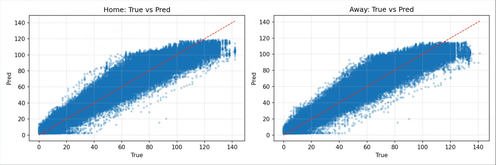
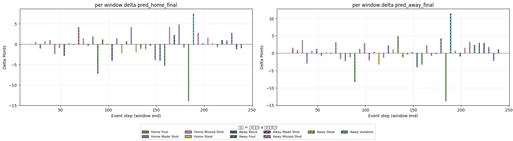

# 🏀 영상 기반 농구 경기 분석 및 점수 예측 AI

> **농구 중계 영상 한 편을 입력하면, 선수·공·점수판을 자동으로 읽어 경기 흐름을 분석하고
> 실시간으로 최종 점수와 승패 확률을 예측하는 End-to-End 딥러닝 파이프라인입니다.**

<p align="center">
  
</p>

<p align="center">
  <em>중계 영상 위에 최종 점수 예측 · 승리 확률 · 실시간 이벤트 로그를 오버레이한 결과</em>
</p>

<p align="center">
  
  
  
  
  
</p>

---

## 📑 목차

- [🏀 영상 기반 농구 경기 분석 및 점수 예측 AI](#-영상-기반-농구-경기-분석-및-점수-예측-ai)
  - [📑 목차](#-목차)
  - [1. 프로젝트 개요](#1-프로젝트-개요)
  - [2. 핵심 결과 한눈에 보기](#2-핵심-결과-한눈에-보기)
  - [3. 시스템 구조](#3-시스템-구조)
  - [4. 핵심 기능](#4-핵심-기능)
    - [4.1 객체 탐지 및 추적 (YOLO + ByteTrack)](#41-객체-탐지-및-추적-yolo--bytetrack)
    - [4.2 점수판 OCR (EasyOCR)](#42-점수판-ocr-easyocr)
    - [4.3 LSTM 기반 점수·승패 예측](#43-lstm-기반-점수승패-예측)
  - [5. 성능 평가](#5-성능-평가)
    - [학습 곡선](#학습-곡선)
    - [예측 타임라인 (이벤트 진행에 따른 최종 점수 예측)](#예측-타임라인-이벤트-진행에-따른-최종-점수-예측)
    - [예측값 vs 실제값 산점도](#예측값-vs-실제값-산점도)
    - [이벤트별 점수 예측 영향도](#이벤트별-점수-예측-영향도)
    - [정량 성능 요약](#정량-성능-요약)
  - [6. 문제 해결 사례](#6-문제-해결-사례)
  - [7. 저장소 구조](#7-저장소-구조)
  - [8. 실행 방법](#8-실행-방법)
  - [9. 팀 구성](#9-팀-구성)
  - [10. 향후 개선 방향](#10-향후-개선-방향)

---

## 1. 프로젝트 개요

농구 경기 영상을 **실시간으로 분석**하여 선수·공·점수판 정보를 자동으로 추출하고,
이를 바탕으로 경기 흐름(슛·패스·리바운드·스틸/블락·파울)을 분석한 뒤
**최종 점수와 승패를 예측**하는 AI 시스템입니다.

기존 농구 분석은 이미 정리된 통계 데이터에 의존하는 경우가 많아 경기 중 세부 상황을
충분히 반영하지 못했습니다. 본 프로젝트는 **영상 자체에서 데이터를 직접 추출**함으로써,
득점·파울 같은 단순 이벤트뿐 아니라 공 점유율·선수 위치 같은 맥락 정보까지 반영하여
더 풍부한 분석과 예측을 제공하는 것을 목표로 합니다.

| 항목 | 내용 |
| --- | --- |
| **프로젝트 기간** | 2026.03.17 ~ 2026.05.25 |
| **구성** | 4인 팀 프로젝트 |
| **입력** | 농구 중계 영상 (mp4) |
| **출력** | 실시간 최종 점수 예측 · 승리 확률 · 이벤트 타임라인 오버레이 영상 |
| **시연 영상** | 2020 NBA Playoffs — Utah Jazz vs Denver Nuggets, Game 6 (약 26분) |

---

## 2. 핵심 결과 한눈에 보기

영상에서 추출한 이벤트가 누적될수록 예측 점수와 승리 확률이 실시간으로 갱신됩니다.

<p align="center">
  
</p>

> 위 화면에서 우측 패널은 **HOME / AWAY 최종 점수 예측(117 : 108)**, **HOME 승리 확률**,
> 그리고 **최근 이벤트 리스트**를 보여줍니다. 어웨이가 득점에 성공하면 최근 이벤트에
> "슛 성공"이 추가되고, 그에 따라 홈팀 승리 확률과 최종 점수 예측이 즉시 하향 조정됩니다.

| 지표 | 결과 |
| --- | --- |
| 선수 객체 탐지율 | 전체 프레임의 **97%** |
| 공 객체 탐지율 (보간·칼만 필터 적용 후) | **72%** (원본 탐지 48% → 후처리로 향상) |
| 이벤트 추출 정확도 | 파울 제외 **60% 이상** |
| 점수 예측 Val MAE | **6.79점** (전체 경기 기준) |
| 점수 예측 MAE (4쿼터) | **2.1점** (경기 후반 정확도) |

---

## 3. 시스템 구조

영상을 입력받아 **① 객체 탐지·추적 → ② 점수판 OCR → ③ 특징 추출 → ④ LSTM 예측 → ⑤ 시각화**
순서로 처리합니다.



**데이터 처리 흐름**

- 🎥 경기 영상 입력 (OpenCV로 프레임 분리)
- 🟦 객체 탐지 (YOLOv8) — 선수·심판·공·림/골대
- 🔗 객체 추적 (ByteTrack) — 프레임 간 동일 객체 연결
- 🧹 후처리 — 코트 밖 오탐 제거, 공 궤적 보정
- 🏷 이벤트 추출 → [`event_summary.csv`](event_summary.csv)
- 🔢 점수판 OCR (EasyOCR) → [`score_timeline.csv`](score_timeline.csv)
- 🧮 특징 추출 및 데이터 정제 → `X_data.pt`, `y_data.pt`
- 🤖 LSTM 기반 점수·승패 예측
- 📊 결과 시각화

---

## 4. 핵심 기능

### 4.1 객체 탐지 및 추적 (YOLO + ByteTrack)

경기 영상에서 선수·공·골대·심판을 인식하고 추적하여 경기 이벤트를 추출합니다.

<p align="center">
  
</p>

<p align="center"><em>선수(파랑)·공(빨강)·골대(주황) 객체 탐지 및 팀 구분 결과</em></p>

**처리 흐름**

```
OpenCV 프레임 분리
  → YOLO 객체 탐지 (선수·심판·공·림/골대)
  → 코트 영역(polygon) 기준 코트 밖 오탐 제거
  → 공 전용 모델 + 보조 탐지로 공 후보 확보
  → 공 후보 필터링 → 보간 → 칼만 필터 → 이상치 제거
  → 유니폼 색·위치 기반 팀 구분
  → 공-선수 거리로 공 소유자 추정
  → 공 궤적·림 위치·소유권 변화로 이벤트 추정
  → CSV 저장 (탐지 결과 · 이벤트 · 팀별 요약 통계)
```

**이벤트 판정 로직**

| 이벤트 | 판정 기준 |
| --- | --- |
| **슛 성공/실패** | 공이 림 반경 안으로 진입 → 링 중심 높이를 통과하면 성공, 아니면 실패 |
| **리바운드** | 슛 실패 후 공 소유권을 다시 잡은 팀 |
| **패스** | 공이 같은 팀 객체로 이동 |
| **스틸/블락** | 공이 상대 팀 객체로 이동 |
| **파울(후보)** | 상대 팀 선수 둘이 근접한 상태에서 소유권 변화 발생 |

> **공 객체 처리 파이프라인** — 농구공은 작고 빠르며 자주 가려지기 때문에 별도 모듈로 안정화합니다.
> `공 후보 탐지 → 필터링 → 실제 공 선택(motion association) → 누락 구간 보간 → 칼만 필터 좌표 안정화 → 이상치 제거 → 최종 궤적 생성`

추출된 이벤트는 다음과 같이 CSV로 저장됩니다.

<p align="center">
  
</p>

**사용 데이터셋 (Roboflow 파인튜닝)**

- 공 객체 탐지 모델 1 — *NBA Ball Object Detection Model*
- 공 객체 탐지 모델 2 — *only-ball-3798 Computer Vision Dataset*
- 선수 객체 탐지 모델 — *NBA Players Computer Vision Model*
- 코트 영역 필터 모델 — *NBA Court Computer Vision Model*

---

### 4.2 점수판 OCR (EasyOCR)

중계 영상의 점수판에서 **팀명·현재 점수·쿼터·경기 시간**을 자동으로 추출합니다.
방송사마다 점수판 위치·디자인이 달라, 화면 내 점수판 후보 영역을 탐색한 뒤 OCR을 수행합니다.

<p align="center">
  
</p>

OCR은 모션 블러·압축 노이즈·화면 전환의 영향으로 오인식이 잦기 때문에,
**농구 규칙 기반 후처리**로 인식 안정성을 확보했습니다.

- ✅ **규칙 기반 필터링** — 점수가 감소하거나 비정상적으로 크게 증가하면 오인식으로 판단해 제거
- ✅ **Majority Voting** — 동일한 결과가 여러 프레임에서 반복 검출될 때만 최종 결과로 인정
- ✅ **Freeze Recovery** — 점수판이 일시적으로 가려지거나 사라져도 이전 프레임 정보를 일정 시간 유지
- ✅ **시간 보정** — 분석 시간과 실제 경기 시간 차이를 후처리로 최소화

점수 변화가 발생한 시점만 CSV로 저장하여 경기 흐름을 시간 순서대로 기록합니다.

<p align="center">
  
</p>

---

### 4.3 LSTM 기반 점수·승패 예측

객체 탐지 결과(4.1)와 점수판 OCR 결과(4.2)를 통합해 예측 모델의 입력을 생성하고,
**LSTM(Long Short-Term Memory)** 으로 최종 점수를 시계열 회귀합니다.

**학습 데이터 — NBA Play-by-Play Data (1997–2025)**
NBA.com에서 직접 수집한 플레이-바이-플레이 데이터로, 총 **37,928경기 · 18,255,730개의
인게임 이벤트 · 6,319,260개의 슛 정보**를 포함합니다. 이벤트가 시간순으로 저장되어
시계열 학습에 적합합니다.

**모델 네트워크 구조**

| 단계 | 레이어 / 연산 | 입력 → 출력 차원 |
| --- | --- | --- |
| 이벤트 입력 | `event_type_id` | `(B, W)` |
| 피처 입력 | `num_features` | `(B, W, 6)` |
| 임베딩 | `nn.Embedding(num_event_types, 16)` | `(B, W, 16)` |
| 특징 결합 | concat (임베딩 + 특징) | `(B, W, 22)` |
| 시퀀스 처리 | `LSTM(hidden=128, layers=2, dropout=0.2, batch_first)` | `(B, 128)` |
| 예측 출력층 | `MLP: Linear(128→64) → ReLU → Dropout → Linear(64→2)` | `(B, 2)` |
| 최종 출력 | `(remaining_home, remaining_away)` | `(B, 2)` |

**입력 피처 (6차원)**

| 피처 | 설명 |
| --- | --- |
| `elapsed_game_sec` | 경기 시작 후 경과 시간(초) |
| `period` | 쿼터 번호 |
| `clock_sec_remaining` | 현재 쿼터 잔여 시간(초) |
| `current_home_points` | 현 시점 홈팀 누적 점수 |
| `current_away_points` | 현 시점 원정팀 누적 점수 |
| `team_side` | 이벤트 귀속 팀 (홈=1.0 / 어웨이=0.0 / 무귀속=0.5) |

**학습 설정**

- **손실:** SmoothL1 (Huber) — 큰 오차에 덜 민감해 회귀 안정성 확보
- **평가 지표:** MAE (점수 단위 절대 오차)
- **옵티마이저:** AdamW (`lr=1e-3`, `weight_decay=1e-4`)
- **LR 스케줄러:** ReduceLROnPlateau (val loss 정체 시 `lr × 0.5`)
- **정규화/안정화:** gradient clipping(1.0), dropout, weight decay, early stopping(patience=5)
- **슬라이딩 윈도우 크기:** 20
- **재현성:** `torch.manual_seed(42)` 고정

> **핵심 기법** — ① **이벤트 임베딩**: 범주형 이벤트를 16차원 연속 벡터로 변환해 이벤트 간
> 잠재적 의미 관계를 학습. ② **슬라이딩 윈도우(W=20)**: 직전 20개 이벤트의 맥락을 함께 고려해
> 시계열 학습 안정성과 예측 성능을 향상.

---

## 5. 성능 평가

### 학습 곡선

<p align="center">
  
</p>

| 지표 | 값 |
| --- | --- |
| Val Loss (SmoothL1) | **6.31** |
| Val MAE | **6.79점** |
| 4쿼터 MAE | **2.1점** |

경기 초반에는 불확실성이 커 오차가 크지만, 이벤트가 누적되는 경기 후반(4쿼터)에는
MAE가 **2.1점**까지 수렴합니다.

### 예측 타임라인 (이벤트 진행에 따른 최종 점수 예측)

<p align="center">
  
</p>

<p align="center"><em>파란선: 실제 최종 점수 / 주황선: 예측값. 이벤트가 누적될수록 실제값에 수렴</em></p>

### 예측값 vs 실제값 산점도

<p align="center">
  
</p>

### 이벤트별 점수 예측 영향도

<p align="center">
  
</p>

<p align="center"><em>홈 득점은 홈 예측에 (+), 홈 슛 실패·파울 등은 (-) 영향을 미친다</em></p>

### 정량 성능 요약

| 모듈 | 성능 | 비고 |
| --- | --- | --- |
| 선수 탐지 | 97% | 기본 YOLO 4% → 파인튜닝 후 |
| 공 탐지 | 48% → **72%** | 보간·칼만 필터 적용 후 |
| 이벤트 추출 | 60%+ | 파울 제외 |
| 점수 예측 (MAE) | 6.79 / **2.1**(4Q) | 전체 / 후반 |

---

## 6. 문제 해결 사례

실제 영상 분석에서 마주친 주요 문제와 해결 과정입니다. *(이 프로젝트의 핵심 엔지니어링 포인트)*

<details>
<summary><b>🎯 객체 탐지 — 9가지 문제와 해결</b></summary>

| # | 문제 | 해결 |
| --- | --- | --- |
| 1 | 기본 YOLO 탐지율 부족 (전체 프레임의 ~2%만 탐지) | Roboflow 데이터셋(객체별 2,000장+)으로 파인튜닝 → 탐지 수·정확도 약 **10배** 증가 |
| 2 | 코트 밖(관중석·벤치·광고판) 오탐 | 코트를 polygon으로 정의. 선수·심판은 bbox 하단 중앙점, 공·골대는 중심점 기준으로 코트 내부 판정 |
| 3 | 공 탐지율 낮음 (~15%) | 공 전용 모델 + 보조 모델 추가, 림 주변 crop·화면 분할 탐지 도입 |
| 4 | 공 탐지를 늘리자 오탐 증가 | bbox 크기·종횡비 검사, 선수 몸통 내부 저신뢰 후보 제거, 림 주변 정지 후보 제거 |
| 5 | 한 프레임에 공 후보 다수 | **Motion Association** — 이전 궤적·이동 방향으로 예상 위치를 계산해 가장 자연스러운 후보 선택 |
| 6 | 공 궤적 끊김 | 선형/포물선 **보간** (단, 짧은 구간만 보간하고 긴 구간은 새 궤적으로 분리) |
| 7 | 공 좌표가 프레임마다 흔들림 | **칼만 필터** (위치 + 속도 추정) 적용해 좌표 안정화 |
| 8 | 보간·예측으로 잘못된 좌표 생성 | 최종 재정제 — 과도 이동·화면 가장자리 저신뢰·객체와 동떨어진 공 후보 제거 |
| 9 | 스틸/블락 구분 불확실 | 공 탐지 한계로 둘을 하나로 묶어 소유권 이동 기준으로 판정 |

</details>

<details>
<summary><b>🔢 점수판 OCR — 4가지 문제와 해결</b></summary>

| # | 문제 | 해결 |
| --- | --- | --- |
| 1 | 숫자 오인식 (3↔8, 5↔6 등) | 농구 규칙 기반 후처리 — 점수는 감소하지 않고 1·2·3점 단위로 증가한다는 특성 활용 |
| 2 | 모션 블러·압축 노이즈로 인한 오인식 | 동일 결과 반복 검출(majority voting) 시에만 인정 |
| 3 | 리플레이·카메라 전환으로 점수판 일시 소실 | **Freeze Recovery** — 이전 프레임 정보를 일정 시간 유지 |
| 4 | 분석 시간 ≠ 실제 경기 시간 | 급격·비정상 시간 값 제외, 안정적으로 반복 검출된 시간만 사용 |

</details>

---

## 7. 저장소 구조

```
BasketballBroadcastAnalysis/
├─ 🎥 영상 처리 (객체 탐지 · 추적)
│  ├─ video_yolo.py                  # 탐지 파이프라인 엔트리포인트
│  ├─ tracking_pipeline.py           # YOLO 탐지 + ByteTrack 추적 (메인 로직)
│  ├─ court_filter.py                # 코트 polygon 기반 코트 밖 객체 제거
│  ├─ ball_tracker.py                # 칼만 필터 · 보간 · motion association · occlusion 처리
│  ├─ ball_coordinate_refiner.py     # 공 좌표 최종 정제 + 검증 영상 생성
│  ├─ basketball_postprocess.py      # 코트 필터 → 공 선택 → 공 보정 통합 wrapper
│  └─ ball_possession.py             # 공-선수 거리 기반 공 소유자 추정
│
├─ 🔢 점수판 OCR
│  ├─ scoreboard_ocr.py              # EasyOCR 기반 점수판 인식 (팀명·점수·쿼터·시간)
│  ├─ score_ocr.py                   # OCR 보조 유틸
│  └─ score_final_ocr.ipynb          # 점수판 OCR + 경기시간 보정 노트북
│
├─ 🧮 데이터 전처리 · 라벨링
│  ├─ preprocess_X_data.py           # 탐지 결과 → 정규화된 입력 텐서(X_data.pt)
│  └─ labeling_Y_data.py             # 이벤트 기반 라벨 생성(y_data.pt)
│
├─ 🤖 예측 모델
│  └─ point_prediction.ipynb         # LSTM 학습 · 평가 · 시각화
│
├─ 📓 통합 노트북
│  ├─ basketball_full_pipeline.ipynb         # 전체 파이프라인
│  └─ basketball_event_stats_detection.ipynb # 이벤트·통계 추출
│
├─ 📊 산출물 (CSV)
│  ├─ video_detection.csv            # 프레임별 객체 탐지 결과
│  ├─ event_summary.csv              # 추출된 경기 이벤트
│  └─ score_timeline.csv             # 점수판 OCR 타임라인
│
├─ 🎬 demo/                          # 시연 영상 · 보고서 (로컬 전용)
└─ 📁 docs/assets/                   # README 시각 자료
```

> ℹ️ `dataset/`, `runs/`, 학습 가중치(`*.pt`), 영상(`*.mp4`)은 용량 문제로 `.gitignore` 처리되어 있습니다.

---

## 8. 실행 방법

> ⚠️ 학습/추론에는 YOLO 파인튜닝 가중치, NBA Play-by-Play 데이터셋, 입력 영상이 필요합니다.
> (용량 문제로 저장소에 포함되어 있지 않습니다.)

```bash
# 1. 의존성 설치
pip install ultralytics easyocr opencv-python pandas torch numpy

# 2. 객체 탐지 + 추적 (영상 → video_detection.csv, event_summary.csv)
python video_yolo.py

# 3. 점수판 OCR (영상 → score_timeline.csv)
python scoreboard_ocr.py --video <영상경로>

# 4. 학습 데이터 전처리
python preprocess_X_data.py    # → X_data.pt
python labeling_Y_data.py      # → y_data.pt

# 5. LSTM 학습 · 예측 · 시각화
#    point_prediction.ipynb 실행

# (또는) 전체 파이프라인 노트북 실행
#    basketball_full_pipeline.ipynb
```

<!-- TODO: 전체 시연 영상(YouTube) 링크 추가 -->

---

## 9. 팀 구성

| 이름 | 담당 역할 | 주요 업무 |
| --- | --- | --- |
| **김동욱** | 영상 분석 및 객체 인식 | YOLO 기반 선수·공·골대 탐지, ByteTrack 객체 추적 |
| **김남균** | 피처 엔지니어링 | 경기 흐름 데이터 정제, 특징 추출, 학습용 데이터셋 구성 |
| **임예린** | 시스템 통합 및 시각화 | 점수판 OCR 구현, 모듈 통합, 결과 시각화 및 인터페이스 |
| **최재현** | 예측 모델 | 시계열 LSTM 모델 설계·학습, 점수 및 승패 예측 |

---

## 10. 향후 개선 방향

- 🎯 **공 객체 탐지 성능 향상** — 더 큰 농구 전용 데이터셋 확보로 스틸/블락 등 세밀한 이벤트 구분
- 🧠 **모델 고도화** — Transformer 계열 시계열 모델 도입, 선수 위치/공 점유율 등 공간 피처 추가
- 🌐 **실시간 서비스화** — 스트리밍 입력 대응 및 웹 기반 실시간 분석 인터페이스
- 🏈 **타 종목 확장** — 동일 파이프라인 구조를 다른 스포츠 종목으로 일반화

---

<p align="center">
  <sub>본 README는 프로젝트 보고서와 시연 결과를 기반으로 작성되었습니다. · 2026</sub>
</p>
